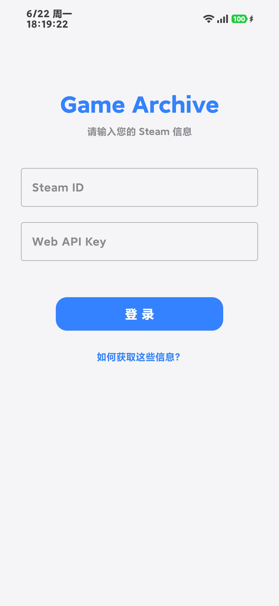
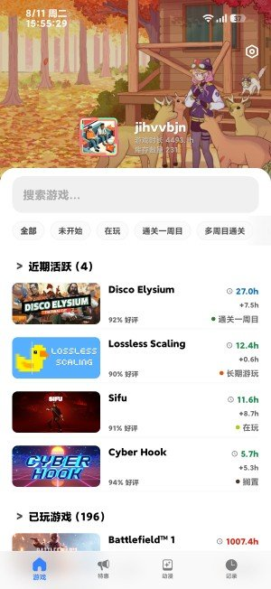
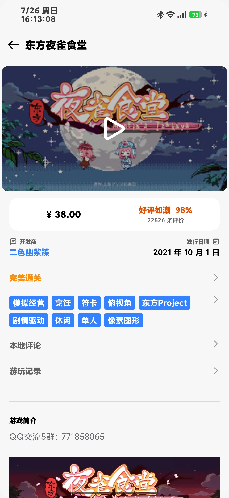
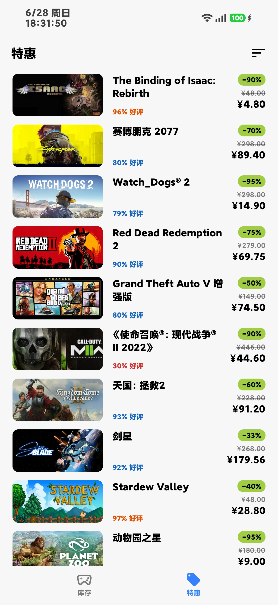
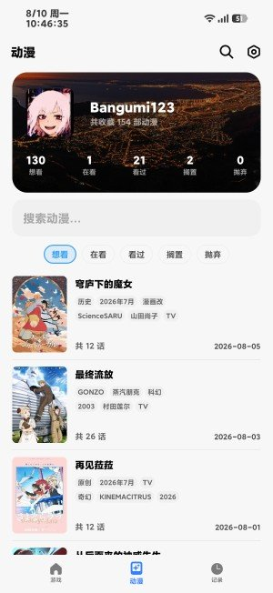
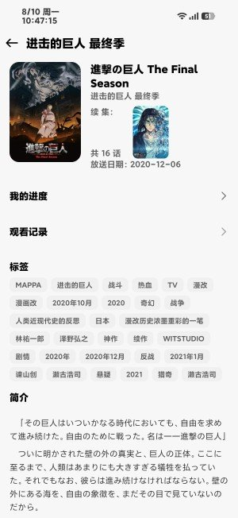
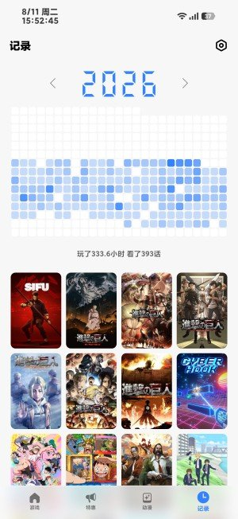
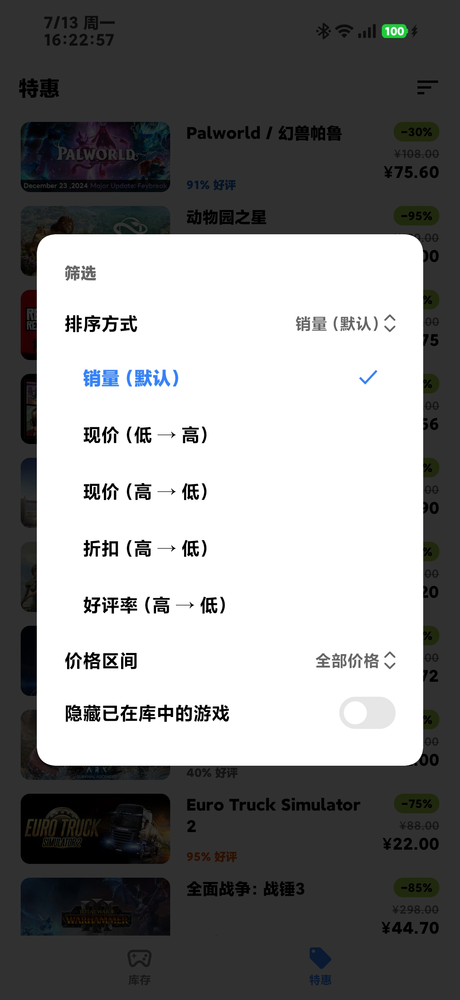
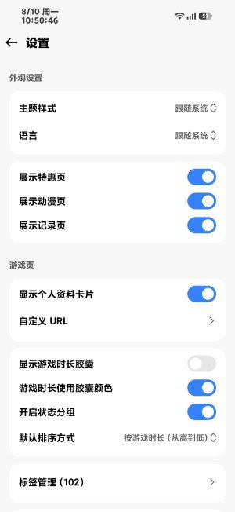

<div align="center">


</div>

## 项目简介

GameArchive 最初用于整理 Steam 库存，现在也可以连接 Bangumi 管理动漫收藏，并把游玩时长与观看进度汇总为个人活动记录。

项目面向希望自行掌握数据的玩家和动漫观众：账号配置、标签、备注、进度基线和活动历史主要保存在设备本地，不提供账号体系或云端数据库。

> [!NOTE]
> 本项目是非官方、非商业的个人开源项目，与 Valve、Steam 或 Bangumi 没有隶属或合作关系。

## 界面预览

<table>
  <tr>
    <td align="center"><br>登录</td>
    <td align="center"><br>游戏库</td>
    <td align="center"><br>游戏详情</td>
  </tr>
  <tr>
    <td align="center"><br>Steam 特惠</td>
    <td align="center"><br>动漫收藏</td>
    <td align="center"><br>动漫详情</td>
  </tr>
  <tr>
    <td align="center"><br>活动记录</td>
    <td align="center"><br>筛选与排序</td>
    <td align="center"><br>设置</td>
  </tr>
</table>

## 功能

### Steam 游戏库

- 读取玩家资料、等级和库存，支持多个 Steam 账号合并展示。
- 按名称、游玩时长、自定义状态和标签筛选、排序或分组。
- 提供未玩、在玩、通关、多周目、长期、完美、搁置和放弃八种本地状态。
- 支持自定义名称、标签、备注、个人头像、挂件和资料背景。
- 自动读取 Steam 资料装扮与动态背景，手动设置的内容优先。
- 游戏详情包含媒体画廊、商店简介、玩家评价、本地评论、游玩记录与个人成就。

### Bangumi 动漫

- 通过 Bangumi OAuth 登录并读取五类动漫收藏。
- 支持列表与网格两种展示方式，以及评分显示偏好。
- 支持模糊搜索 Bangumi 动漫条目并打开详情。
- 在详情页编辑收藏状态、正篇进度、评分、标签和吐槽，并同步到 Bangumi。
- 展示条目信息、制作人员、简介和观看记录。
- 本地保留标签输入顺序；观看记录可以修改，并同步修正记录页统计。

### 活动记录

- 使用年度热力图展示每天的游戏与动漫活动。
- Steam 仅统计标记为“在玩”的游戏在刷新时检测到的新增时长。
- Bangumi 仅统计标记为“在看”的动漫新增正篇话数，不计番外。
- 首次同步只建立基线，不会把过去的累计数据算入当天。
- 可以查看某一天或从首次记录至指定日期的封面历史，并跳转到对应详情页。
- 如果关闭动漫页，只展示游戏活动记录。

### Steam 特惠与个性化

- 抓取 Steam 特惠列表，过滤常见 DLC、原声带和季票。
- 支持按评价、价格、折扣和销量排序。
- 支持浅色、深色和跟随系统主题，以及中英文界面。
- 游戏时长胶囊、状态分组、页面显示和动漫展示方式均可配置。
- 本地备份可导出和恢复标记、标签、备注、自定义名称、活动统计及部分外观设置。

## 下载与使用

前往 [Releases](https://github.com/ewiro/GameArchive/releases) 下载 APK：

- `arm64-v8a`：推荐用于绝大多数现代 Android 手机。
- `armeabi-v7a`：用于仍为 32 位架构的旧设备。

最低系统版本为 Android 7.0（API 24）。

### Steam

首次使用需要：

1. SteamID，即个人资料对应的数字 ID。
2. [Steam Web API Key](https://steamcommunity.com/dev/apikey)。

应用不会要求 Steam 密码、Steam Guard 验证码或登录 Cookie。库存必须设为公开，Steam API 才能返回完整数据。

### Bangumi

Bangumi 功能为可选项。点击设置中的添加账号并选择 Bangumi 后，应用会打开浏览器完成 OAuth 授权。

## 从源码构建

### 环境

- Android Studio
- JDK 17
- Android SDK 37

### 配置

1. 克隆仓库：

   ```bash
   git clone https://github.com/ewiro/GameArchive.git
   cd GameArchive
   ```
2. 将配置模板复制为本地配置：

   ```text
   app/src/main/java/com/example/gamearchive/AppConfig.kt.example
   → app/src/main/java/com/example/gamearchive/AppConfig.kt
   ```
3. 根据需要配置：

   - `PROXY_URL`：默认公共代理或自行部署的 Worker 地址。
   - `BANGUMI_CLIENT_ID`、`BANGUMI_CLIENT_SECRET`：在 [Bangumi 开发者平台](https://bgm.tv/dev/app) 注册应用后获得。
   - `BANGUMI_REDIRECT_URI`：须与开发者平台登记值及 Manifest 回调保持一致。

   `AppConfig.kt` 已被 `.gitignore` 排除，不要提交真实凭证。
4. 构建 Debug APK：

   ```bash
   # Windows
   .\gradlew.bat assembleDebug

   # macOS / Linux
   ./gradlew assembleDebug
   ```

### 自建代理

根目录的 [`cloudflare_worker.js`](cloudflare_worker.js) 是默认代理脚本。部署到自己的 Cloudflare Worker 后，将 `AppConfig.kt` 中的 `PROXY_URL` 替换为对应地址即可。

## 技术实现

- Kotlin 2.4.0、JVM 17
- Compose Multiplatform 1.11.1
- MIUI X (`miuix-ui` / `miuix-icons`)
- Activity 导航与 MVVM
- Retrofit、OkHttp、Gson
- Kotlin Coroutines
- Coil
- SharedPreferences 本地存储
- Cloudflare Worker 请求转发

## 反馈与贡献

欢迎通过 [Issues](https://github.com/ewiro/GameArchive/issues) 报告问题或提出建议。报告问题时建议附上：

- GameArchive 版本、设备型号和 Android 版本
- 可重复的操作步骤
- 实际结果与预期结果
- 必要的截图或已去除账号凭证的日志

提交 Pull Request 前，请尽量让改动保持单一目标，并确认没有提交 Steam API Key、Bangumi OAuth 凭证、签名文件或本地配置。

## 致谢

- [Steam Web API](https://steamcommunity.com/dev)
- [Bangumi API](https://github.com/bangumi/api)
- [MIUI X](https://github.com/compose-miuix-ui/miuix)
- [DSEG](https://www.keshikan.net/fonts-e.html)
