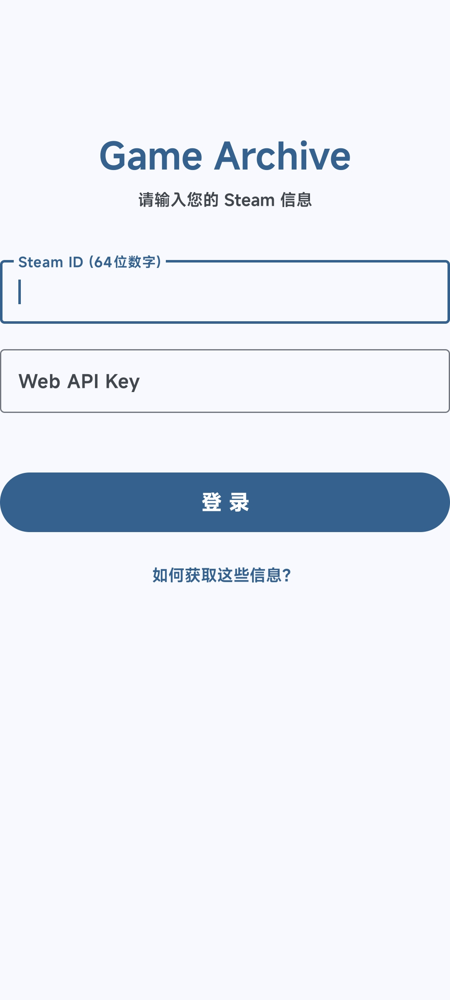
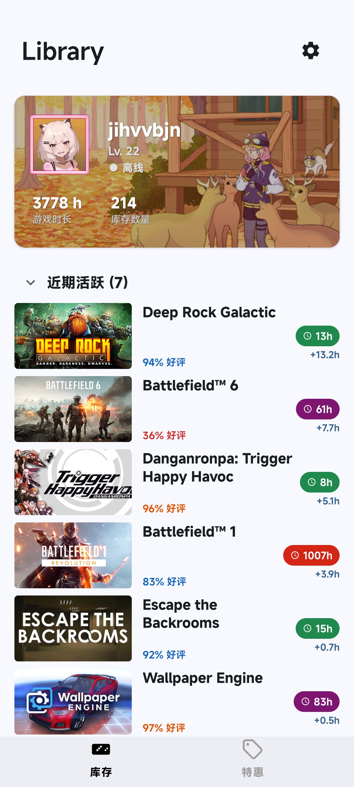
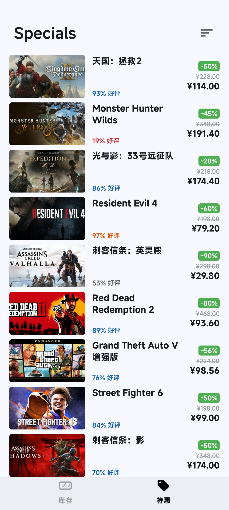
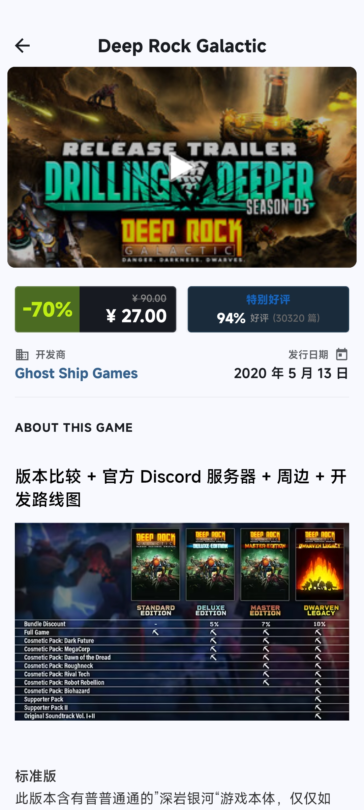
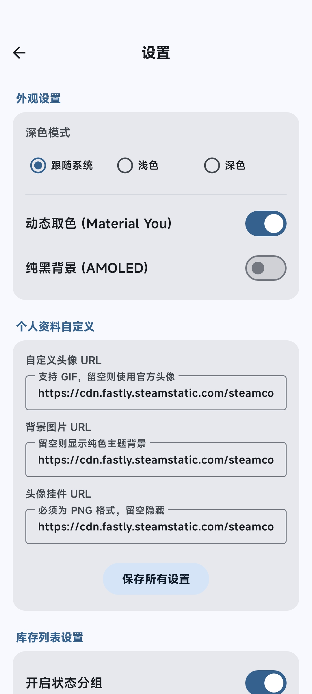
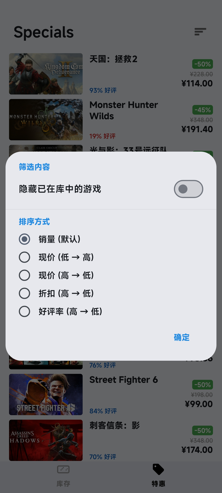

 

# Game Archive 

> A modern Steam library management and special offers query tool designed based on Material Design 3.

---

##  Screenshot Preview 

| Login & Setup | My Library  | Specials  | Immersive Details  | Settings | Sort & Filter |
|:---:|:---:|:---:|:---:|:---:|:---:|
|  |  |  |  | | |

---

##  Core Features 

###  My Library
*   **Visuals**: Fully adapted to **Material You**, with UI colors dynamically changing based on the wallpaper. Supports Dark/Pure Black modes.
*   **Statistics**: Displays avatar, level, total game count, and total playtime at the top.
*   **Cards**: List card colors are dynamically graded based on playtime (from light to dark), intuitively showing your "dedication."

###  Specials Query
*   **Experience**: Built-in filtering automatically removes DLCs, soundtracks, season passes, etc., displaying only the **base games**.
*   **Data**: Uses concurrent scraping technology to load hundreds of discounted games at once.
*   **Sorting**: Supports multi-dimensional sorting by **Review Rating**, **Current Price**, **Discount**, and **Sales**.
*   **Reviews**: The list directly displays review ratings (e.g., "95% Positive") and distinguishes rating levels with different colors.

###  Immersive Details 
*   **Gallery**: Horizontal sliding 16:9 adaptive gallery, seamlessly splicing videos and screenshots for a borderless experience.
*   **Reviews**: Directly integrates the Steam player review section, supporting long reviews without truncation.
*   **Layout**: Uses JS/CSS injection technology to rearrange cluttered Steam description HTML, removing excess spacing for a beautiful text-image layout.
*   **Cover**: Automatically fixes irregular promotional images, prioritizing the display of standard Steam covers.

###  Customization
*   Supports custom profile backgrounds, avatars, and **avatar frames**.
*   Supports custom Cloudflare Worker proxy addresses.

---

##  Privacy & Security

We understand the importance of Steam account security, therefore:

1.  **Local Storage**: All Steam IDs and Web API Keys are stored only in the local encrypted storage (`SharedPreferences`) of your phone.
2.  **Zero Collection**: This project has **no** backend servers and will not collect or upload any of your personal information.
3.  **Open Source & Transparent**: All code (including proxy server scripts) is completely open source, allowing you to audit it at any time.

---

##  Deployment & Usage

### 1. Download & Install
Go to the [Releases Page](https://github.com/YourUsername/GameArchive/releases) to download the latest version of the APK.
*   Modern phones are recommended to download the `arm64` version.

### 2. Get Necessary Information
You need to enter your Steam information for the first time use:
*   **Steam ID**: Your 64-digit numeric ID (can be found in your profile link).
*   **Web API Key**: Go to the [Steam Developer Page](https://steamcommunity.com/dev/apikey) to apply for free (domain name can be filled in arbitrarily).

### 3. (Advanced) Self-hosted Proxy Service
To ensure stable access in mainland China, the App uses a built-in Cloudflare Worker proxy by default.
For absolute data security and faster speeds, **it is strongly recommended that you deploy your own Worker**.

 **[Click to View: Self-hosted Cloudflare Worker Tutorial](WORKER_SETUP.md)**

---

##  Tech Stack
This project is built using modern Android development standards:

*   **Language**: [Kotlin](https://kotlinlang.org/)
*   **Architecture**: MVVM (Fragment + ViewPager2)
*   **Network**: [Retrofit](https://square.github.io/retrofit/) + [OkHttp](https://square.github.io/okhttp/) + [GSON](https://github.com/google/gson)
*   **Image Loading**: [Coil](https://coil-kt.github.io/coil/) (optimized for GIF animations and memory caching)
*   **UI Components**: Material Design 3, ConstraintLayout, CoordinatorLayout
*   **Asynchronous Processing**: Kotlin Coroutines (Async/Await concurrent requests)
*   **Backend/Proxy**
  
---

##  License

This project is open sourced under the MIT License - see the [LICENSE](LICENSE) file for details.
